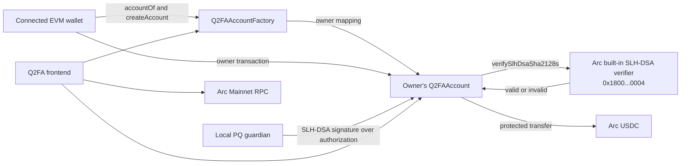

# Q2FA

> Two keys. One protected account.

Q2FA is a post-quantum two-factor smart account on Arc Mainnet. The normal EVM owner wallet is Factor 1. An independent SLH-DSA post-quantum guardian is Factor 2. A protected action succeeds only when both authorize the same payload.

**A stolen wallet key alone is not enough to move Q2FA-protected funds.** Q2FA uses Arc's built-in SLH-DSA verifier to turn a post-quantum signature into a real onchain second authorization factor.

**EVM Wallet + PQ Guardian = Protected Action**

- Stolen wallet only: **BLOCKED**
- Wallet plus PQ guardian: **AUTHORIZED**

Q2FA is live on Arc Mainnet. Its security claim applies to the protected actions of the deployed smart-account code and depends on the guardian remaining independent and uncompromised. Arc's PQ verifier is experimental infrastructure; Q2FA is not audited production custody software.

## Live links

- Frontend: [q2fa.vercel.app](https://q2fa.vercel.app)
- Backend health: [q2fa.onrender.com/health](https://q2fa.onrender.com/health) — optional operational endpoint; the frontend does not require the backend for account authorization.

## Arc Mainnet

- Network: Arc Mainnet
- Chain ID: `5042`
- RPC: `https://rpc.mainnet.arc.io`
- Q2FA account factory: `0x378330579a0c76215994e774b95a3413c2efba34`
- Built-in SLH-DSA verifier: `0x1800000000000000000000000000000000000004`
- USDC ERC-20 interface: `0x3600000000000000000000000000000000000000`

## The problem: what happens if someone steals your wallet key?

For a normal EVM wallet, possession of its private key may be enough to authorize a transfer:

```text
Wallet key stolen
        ↓
Attacker controls the wallet
        ↓
Funds may be moved
```

Q2FA changes the authorization rule for funds deposited into its smart account. The EVM wallet still submits the transaction, but it is no longer sufficient by itself:

```text
EVM Wallet + PQ Guardian = Protected Action

EVM Wallet ✓   PQ Guardian ✕   → BLOCKED
EVM Wallet ✓   PQ Guardian ✓   → AUTHORIZED
```

## How Q2FA works

Each Q2FA account requires two independent factors for protected actions.

**Factor 1 — EVM wallet.** The current account owner submits the transaction with a normal EVM wallet. Arc network fees are paid in USDC.

**Factor 2 — post-quantum guardian.** A client-side SLH-DSA-SHA2-128s guardian signs the exact protected action. The smart account verifies that signature onchain through Arc's built-in verifier.

The deterministic authorization payload binds the Arc chain ID, Q2FA account address, action type, recipient or subject, amount where applicable, nonce, and deadline. Changing a bound value makes the signature invalid; a successful action consumes its nonce.

## Why Arc?

Q2FA is not simply an application deployed on Arc. Its core two-factor security model depends on Arc's built-in SLH-DSA post-quantum signature verifier.

The PQ guardian signs the exact protected action, and the Q2FA smart account verifies that signature onchain as part of its authorization logic. The guardian is therefore a contract-enforced second factor, not an offchain approval or a frontend convention.

Without Arc's native verifier, this exact implementation would require a substantially heavier custom verifier, an external verification system, or a different security architecture. **Arc is not just Q2FA's execution environment — it is the infrastructure that makes the post-quantum second factor practical onchain.**

Arc's verifier is experimental/emerging infrastructure. This integration is a feasibility-proven Mainnet implementation, not an external security audit or a guarantee against compromise. See Circle's [Arc documentation](https://docs.arc.io/) and the [circlefin/arc-node source](https://github.com/circlefin/arc-node).

## Multi-user accounts

The factory discovers accounts by connected owner wallet. Each connected wallet resolves only its own factory mapping:

```text
Connect wallet
      ↓
Read factory.accountOf(wallet)
      ↓
Account found? ── YES → Load that account
      │
      └──────────── NO → Create an account for this wallet
```

Each account has its own owner, PQ guardian, protected balance, nonce, activity, and authorization state. The factory uses `msg.sender` as owner, records the owner-to-account mapping, and rejects duplicate account creation for an owner. The historical demo account is not used as a fallback for other wallets.

## New-user onboarding

1. Connect an EVM wallet on Arc Mainnet.
2. Generate a PQ guardian locally in the browser.
3. Download a guardian seed backup to a location you control.
4. Re-import the backup and verify that it derives the same public key.
5. Create a Q2FA account through the factory.
6. Deposit USDC into that account.

The guardian seed is generated and restored locally. It is not sent to the backend or stored onchain. Only the public guardian key becomes account state. A backup file is created only when you explicitly download it.

## Protected withdrawal flow

```text
Recipient + amount + nonce + deadline
                  ↓
       PQ guardian signs the payload
                  ↓
         EVM owner submits it
                  ↓
 Q2FA checks both factors and the nonce
                  ↓
             USDC transfers
```

Before submission, the client can run read-only Arc Mainnet simulations and estimate the network fee in USDC. The simulation does not send a transaction or change account state.

## Security proof

Read-only Arc Mainnet simulations exercised the live EVM-only, guardian-only, and owner-plus-guardian paths, along with changed recipient, amount, and action, corrupted signature, expired authorization, and stale nonce checks. Changed account/domain and cross-user cases are also covered by local contract and client regression tests and independent account-discovery checks.

| Scenario | Result |
|---|---|
| EVM owner without a PQ signature | **BLOCKED** |
| Valid PQ guardian signature submitted by a non-owner | **BLOCKED** |
| Owner plus valid PQ guardian signature | **AUTHORIZED** |
| Changed recipient | **BLOCKED** |
| Changed amount | **BLOCKED** |
| Changed action | **BLOCKED** |
| Changed account/domain | **BLOCKED** |
| Corrupted signature | **BLOCKED** |
| Expired authorization | **BLOCKED** |
| Stale or replayed nonce | **BLOCKED** |
| Cross-user authorization | **BLOCKED** |

The in-app Security Demo uses real Arc Mainnet `eth_call` results for the live EVM-only, guardian-only, and two-factor cases; those states are not hardcoded frontend outcomes. The EVM-only simulation was rejected with `InvalidPQSignatureLength(0)`. A valid guardian authorization from a non-owner was rejected with `NotOwner`. The live owner plus guardian withdrawal simulation was authorized. No failing transaction was broadcast for these checks.

```text
ATTACKER                         LEGITIMATE OWNER
EVM Wallet      ✓                EVM Wallet      ✓
PQ Guardian     ✕                PQ Guardian     ✓

BLOCKED                          AUTHORIZED
```

## Mainnet evidence

**Factory deployment**

- Factory: `0x378330579a0c76215994e774b95a3413c2efba34`
- Transaction: `0xdb2261f5150d35a16fa0c18518fc5fc899ae62248b82d10d2ebb9c8b55068a19`

**First factory-created user account**

- Owner: `0xbAbDFEF588cF57eFcc7c8857960E3CCdD9167589`
- Q2FA account: `0xEBA06bB7be5301F4aa12285c26Df2d519ecA88c9`
- Creation transaction: `0x8f9329acb707532cf39aa189a3baa8299374e2761ab53f76b32e29fe0de6cb5d`
- Creation block: `25064021`

Real Arc Mainnet USDC deposits and a protected withdrawal to Wallet B were also completed successfully on the historical verified account. The deposit was `0.000001 USDC` in transaction `0x250b846795c302a8dd67c5b46063379d6527a85196e91771d5ac1d36c2e95c26`; the protected withdrawal was `0.000001 USDC` in transaction `0xb883911a18724ef6a31ed6f9ca3f54a13847ca5413b2efcd69fa18eb76e2e56a`.

These accounts are deployment evidence, not shared product state. In particular, the pre-factory account is a historical demo fixture and is not loaded for a different connected wallet.

## Architecture



The guardian's private seed stays in the client; the arrow represents its signature over the action, not transmission of the private key.

## Tech stack

- **Frontend:** React, TypeScript, Vite, viem
- **Contracts:** Solidity `Q2FAAccount` and `Q2FAAccountFactory`, with Arc SLH-DSA verifier integration
- **Backend:** minimal Node.js/TypeScript health service and development utilities; no database, private-key custody, or guardian custody
- **Authorization:** shared deterministic binary encoding, checked against Solidity's expected payload

The normal authorization flow reads Arc directly from the frontend and signs through the user's wallet and local guardian. The backend is not required to authorize protected actions.

## Guardian security

After a seed is imported, the guardian secret remains in client memory for the active session. It is not persisted in `localStorage`, `sessionStorage`, IndexedDB, the backend, RPC requests, or Git. The secret seed is never contract calldata; protected transactions carry the public key only as account state and the signature over the authorization payload.

Keep the downloaded guardian backup offline in a location you control. The browser clears its in-memory guardian when the session ends. Q2FA V1 does not provide cloud backup or guardian recovery.

## What Q2FA protects

Q2FA protects USDC deposited into a Q2FA smart account. Its protected withdrawal path requires the current EVM owner and a valid PQ guardian signature over the same action.

## What Q2FA does not protect

USDC and other assets left directly in the owner's normal EVM wallet are outside the Q2FA account and receive no Q2FA protection. Deposits into a Q2FA account do not require guardian approval; the two-factor rule protects actions that move funds out of the account.

Q2FA V1 has no guardian recovery, social recovery, owner recovery, or cloud guardian backup. Recovery is future work because a recovery path must not create a bypass around the two-factor model. Losing the guardian backup can make protected actions unavailable.

## Current limitations

- Arc's built-in PQ verifier is experimental/emerging infrastructure.
- Q2FA's contracts have not received an external security audit.
- A lost guardian backup can block protected actions; V1 has no recovery mechanism.
- SLH-DSA signatures are large (7,856 bytes) and can require more gas and calldata than ordinary EVM signatures.
- Q2FA protects only funds held in the smart account, not assets left in the owner's EOA.

Q2FA is not described as quantum-proof, unhackable, or audited production custody software.

## Development

Install the locked workspace dependencies:

```bash
npm ci
```

Run checks:

```bash
npm run check
```

Run the frontend locally:

```bash
npm run dev --workspace=@q2fa/frontend
```

Build the frontend for production:

```bash
npm run build --workspace=@q2fa/frontend
```

Set the factory address in the frontend production environment:

```text
VITE_Q2FA_FACTORY_ADDRESS=0x378330579a0c76215994e774b95a3413c2efba34
```

## Production

- Frontend: [https://q2fa.vercel.app](https://q2fa.vercel.app)
- Optional backend health: [https://q2fa.onrender.com/health](https://q2fa.onrender.com/health)
- Network: Arc Mainnet — Chain ID `5042`
- Frontend production environment: `VITE_Q2FA_FACTORY_ADDRESS=0x378330579a0c76215994e774b95a3413c2efba34`

## Status

**Q2FA V1 is live on Arc Mainnet.**

**Compromising the EVM wallet alone does not provide enough authorization to move Q2FA-protected funds.**
